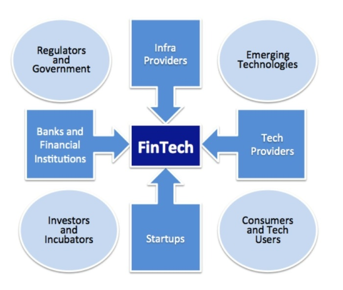
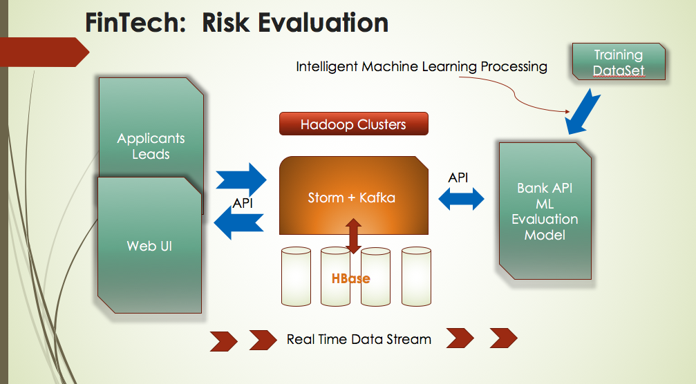
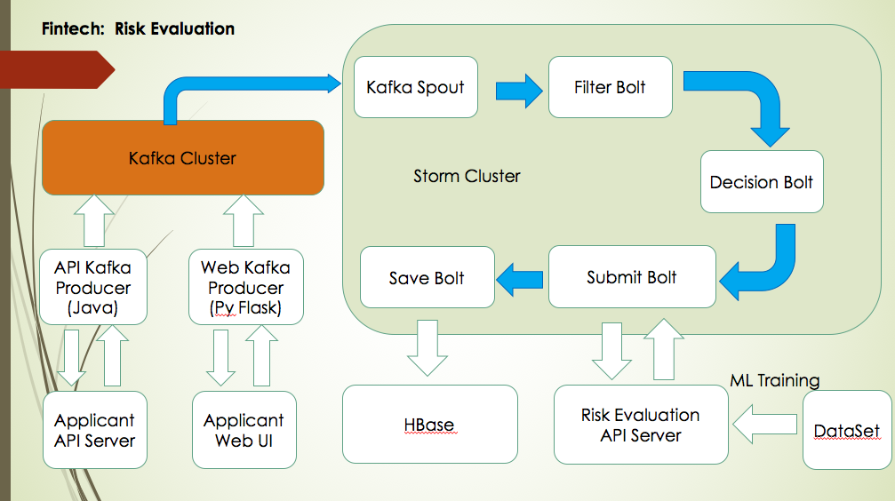
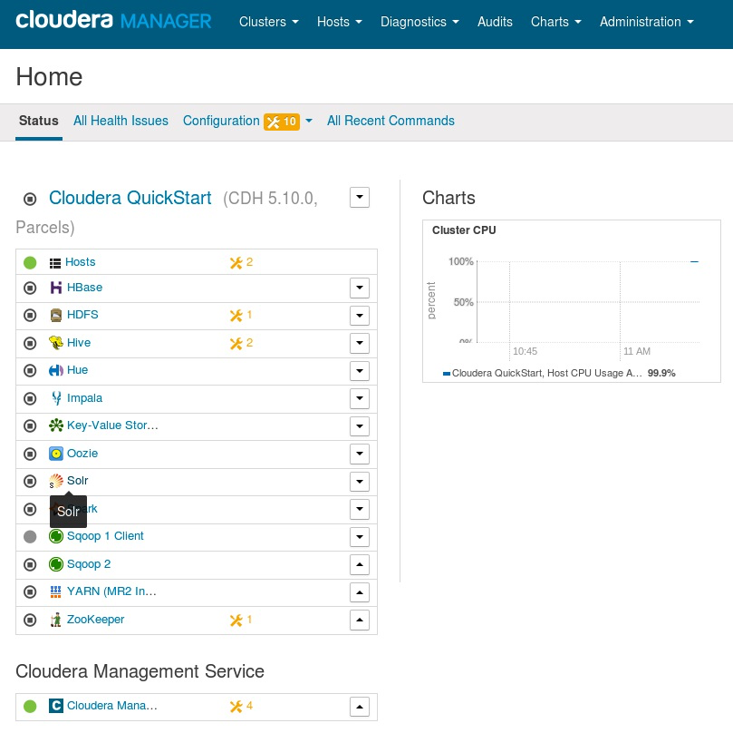
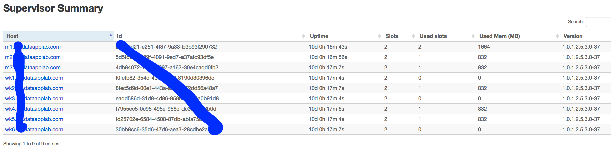
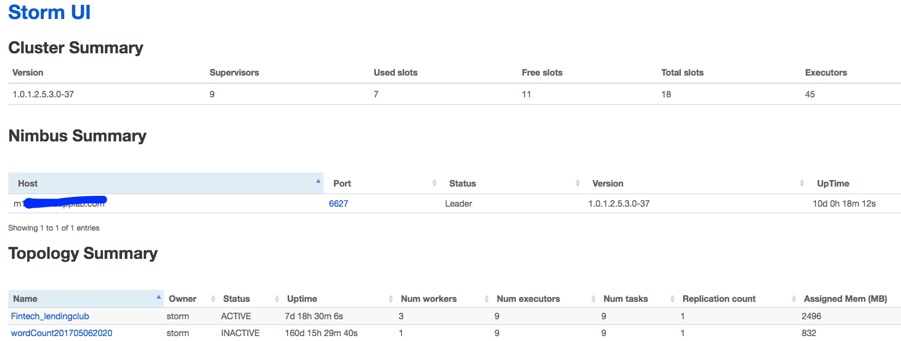

# Project: Realtime Financial Data Processing System

## 1 Overview

**Keywords: FinTech, Apache Storm, Apache Kafka, HBase, Python Flask, Risk Evaluation, Cloudera, Java, Python**

**Financial technology (FinTech or fintech)** is the new technology and innovation that aims to compete with traditional financial methods in the delivery of financial services. The use of smartphones for mobile banking and investing services are examples of technologies aiming to make financial services more accessible to the general public. Financial technology companies consist of both startups and established financial and technology companies trying to replace or enhance the usage of financial services existing financial companies.

This project implements a FinTech realtime processing Pipeline using **Apache Storm and Apache Kafka**. It is a great practice for Storm & Kafka Integration. The **KafkaSpout** inside the Storm Topology subscribes streaming data of applicants, then the Storm Bolts inside the topology will complete several jobs, such as **data mapping, data cleaning and data preprocessing**. When we get the prepared streaming data, the data will be submit to a **Risk Evaluation API**. Based on a **logistic regression model**, this API will return a risk evaluation result about whether the applicant will pay off his/her loan. The whole framework is shown below.

## 2 Architecture

The following picture explains the detailed architecture of this project.

### 2.1 Applicant Data API & Streaming Data Producer

For testing purpose, in this project I created an Applicant Data API using python **Flask framework**, from which I can fetch the applicant data. The applicant data was downloaded from [ledningclub.com](https://www.lendingclub.com/info/download-data.action). Then I stored the data into a **MySQL database**. When user send a **GET request** to this API, it will return a formatted JSON response.

In order to produce **streaming data**, I also implements a **Kafka Producer program via the Java API of Kafka**. Before running the Storm topology, the Kafka Producer will be started firstly. The Kafka Producer program will continuously send requests to the Applicant Data API and push the response data to Kafka Cluster.

### 2.2 Storm Topology

The **KafkaSpout** works as **a consumer of the Kafka Cluster** to read the applicant data from the Kafka Cluster. Then send the data to FilterBolt.

The **FilterBolt** will **map the JSON data** to a Java object via ObjectMapper, and it will filter out the irrelevant data. Because the streaming data is not that clean, this FilterBolt will also perform as a **data cleaner**.

The **DecisionBolt's** job is doing a **preprocessing job**. For example, for some appicants, their credit ratings are pretty low like E, F and G. We will automatically fillter out these applicants as we want reduce the risk.

When the **SubmitBolt** gets the preprocessed data, it will submit the data to the Risk Evaluation API, which is based on a **Logistic Regression model**. And then it will **send the evaluation result** to the SaveBolt.

In the **SaveBolt**, I developed a **HBase helper class**, which is used to simplify the interactions with the HBase Database. Both of the applicant's information and his evaluation result will be stored into HBase database.

## 3 Deployment

### 3.1 Development Environment

* The project is developed under **Cloudera VM (CDH - 5.10.0)**. The use of VM will dramatically reduce the configuration effort
* You need to download and install the **Kafka server**, because the Kafka is not pre-installed on Cloudera VM. ([Download link](https://kafka.apache.org/documentation.html#quickstart))
* Before running the project, you need to start several services like **HDFS, HBase, ZooKeeper, Yarn**...

### 3.2 Deployment on the Cluster
* In this project, I deploy it on the **Montana Cluster(3 master nodes and 6 worker nodes)**.
* To deploy this project to the cluster, you need do a lot of configuration work, such as changing the settings of **Storm-core, Kafka-client and Hbase**. If you are interested, you can view the Fintech_Cluster_Version.md file and the pom.xml file inside the cluster_version folder.

